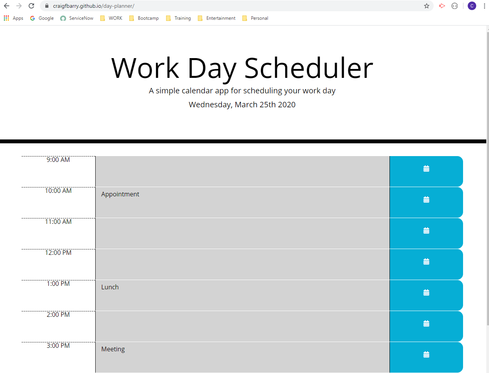

# 05 Third-Party APIs: Work Day Scheduler

This application is a simple workday planner that utilises moment.js
The page displays the current day using moment.js and the time is used in the day planner

A standard workday is dynamically displayed to to the page. It includes hour blocks that are color coded.
It should display a color code depending on whether it is the current hour, ion the past or in the future.

The timeblock should enable the user to enter a task and save the information to local storage.
This should be done utilising a button for each timeblock.
The saved events should persist in the browser so this information needs to be displayed when the page is loaded.

The following animation demonstrates the application functionality:

